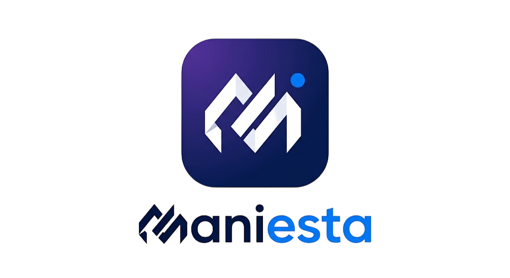

<!-- PROJECT HEADER -->
<div align="center">
  
  <h1 style="font-size: 4rem; font-weight: 800; letter-spacing: -2px; background: linear-gradient(135deg, #22d3ee, #3b82f6, #8b5cf6, #a855f7, #d946ef); -webkit-background-clip: text; -webkit-text-fill-color: transparent; background-clip: text; margin: 0;">MANIESTA</h1>
  <p style="font-size: 1.6rem; color: #9898b0; font-weight: 500; margin-top: -10px;">Digital Products & Interactive Experiences</p>
  <br>
  <p style="font-size: 1.1rem; color: #606070; max-width: 700px; margin: 0 auto;">
    A premium web application showcasing a curated collection of modern digital products. 
    Immersive 3D visuals, fluid animations, and a futuristic interface — all in a single file.
  </p>
  <br>
  <a href="https://maniesta.netlify.app" target="_blank">
    
  </a>
  <a href="#features">
    
  </a>
  <a href="#quick-start">
    
  </a>
  <br><br>
  
  
  
  <br><br>
</div>

---

## 🌟 **Overview**

MANIESTA is more than a portfolio — it's a **digital product ecosystem**.  
This single‑file application combines:

- 🌍 **Real‑time 3D globe** with animated arcs and atmospheric glow
- 🎨 **Wavy simplex‑noise background** in cyan, blue, purple, and magenta
- 🖱️ **Mouse‑tracking text effect** that reveals a multicolor gradient
- 🃏 **Parallax project rows** moving in opposite directions on scroll
- ✨ **Tracing beam** that follows your scroll progress

> **No build step. No dependencies. Just open `index.html` and experience it.**

---

## 🎯 **Why MANIESTA Stands Out**

| Feature                   | Description                                                                  |
| ------------------------- | ---------------------------------------------------------------------------- |
| 🖥️ **Self‑Contained**     | Single HTML file — no bundlers, no npm install, no configuration             |
| 🌌 **Premium Visuals**    | Dark futuristic UI with glassmorphism, gradient accents, and glowing effects |
| 🌍 **3D Globe**           | Real‑time Three.js globe with animated arcs, points, and atmospheric glow    |
| 📜 **Parallax Scrolling** | Project cards move in opposite directions, creating depth and immersion      |
| 🖱️ **Interactive Text**   | MANIESTA wordmark reveals a multicolor gradient that follows your cursor     |
| ✨ **Tracing Beam**       | Scroll‑driven beam connects sections, guiding users through the narrative    |
| 📱 **Fully Responsive**   | Adapts seamlessly from mobile to desktop with performance optimization       |
| ♿ **Accessible**         | Semantic HTML, keyboard navigation, and reduced‑motion support               |

---

## 🔥 **Feature Highlights**

### **Hero Section**

- Animated wavy background with simplex‑noise driven waves
- Lamp glow effect illuminating the MANIESTA heading
- Mouse‑tracking text hover with multicolor gradient reveal
- Floating sparkles that shimmer subtly
- Parallax mouse movement for depth

### **Project Showcase**

- 12+ digital products displayed as 3D tilt cards
- Hover effects with translateZ depth layering
- Category filtering with smooth animated pills
- Three‑row parallax scroll (rows move in opposite directions)
- Dynamic project cards with gradient thumbnails

### **Global Section**

- Interactive Three.js globe with:
  - Auto‑rotation
  - Glowing country points
  - Animated connection arcs
  - Atmospheric glow shader
  - Orbiting rings

### **Technology Stack**

- 15+ technologies displayed as floating cards
- Hover lift effects with purple glow
- Clean, modern grid layout

### **Performance & UX**

- Lazy‑loaded animations (IntersectionObserver)
- `requestAnimationFrame` for smooth 60fps
- `prefers-reduced-motion` support
- Cleanup of all observers, listeners, and 3D resources
- Mobile optimization (reduced 3D intensity, smaller particles)

---

## 🚀 **Quick Start**

### **Option 1: Direct Open**

```bash
git clone https://github.com/usmannmurtazaa/maniesta.git
cd maniesta
start index.html   # Windows
# or
open index.html    # macOS
# or
xdg-open index.html  # Linux
```

### **Option 2: Python Server** (optional, for local hosting)

```bash
python3 -m http.server 8000
# Visit http://localhost:8000
```

### **Option 3: Deploy to Netlify**

1. Drag and drop the project folder onto [Netlify Drop](https://app.netlify.com/drop)
2. Your site goes live instantly

---

## 🎨 **Customization**

### **Projects Data**

Edit the `PROJECTS` array inside the `<script>` tag:

```javascript
const PROJECTS = [
  {
    id: 'my-project',
    title: 'My Project',
    description: 'Description here...',
    category: 'AI',
    technologies: ['React', 'Three.js'],
    link: 'https://example.com',
    colors: ['#22d3ee', '#8b5cf6', '#d946ef'],
  },
];
```

### **Categories**

Modify the `CATEGORIES` array:

```javascript
const CATEGORIES = ['All', 'AI', 'Productivity', 'Education', ...];
```

### **Technologies**

Update the `TECHNOLOGIES` array:

```javascript
const TECHNOLOGIES = [
  { name: 'React', icon: '⚛️' },
  { name: 'Next.js', icon: '▲' },
];
```

### **Color Palette**

Change CSS variables in `:root`:

```css
:root {
  --cyan: #22d3ee;
  --blue: #3b82f6;
  --purple: #8b5cf6;
  --magenta: #d946ef;
}
```

### **Globe Parameters**

Adjust in the `GlobeComponent`:

- `pointsCount` – number of glowing dots
- `arcCount` – number of connection arcs
- `ringCount` – number of orbital rings
- Rotation speed values

---

## 🛠️ **Tech Stack**

| Technology                | Purpose                                                     |
| ------------------------- | ----------------------------------------------------------- |
| **React 18**              | Component‑based UI                                          |
| **htm**                   | JSX‑like syntax without compilation                         |
| **Three.js**              | 3D globe rendering                                          |
| **Framer Motion**         | Smooth animations and parallax effects                      |
| **Custom CSS**            | Styling with modern features (glassmorphism, grid, flexbox) |
| **IntersectionObserver**  | Scroll‑triggered animations                                 |
| **requestAnimationFrame** | Smooth 60fps animation loop                                 |

---

## 📁 **Project Structure**

```
maniesta/
├── index.html          # Complete application (HTML + CSS + JS)
├── icon.png            # Logo
├── README.md           # Documentation
└── .gitignore          # Git ignore rules
```

---

## 🔧 **Development**

This project uses **no build tools** — everything is vanilla HTML/CSS/JS with React loaded via UMD.  
Makes it extremely portable and easy to modify.

### **Edit directly:**

1. Open `index.html` in your preferred editor
2. Find the relevant section (data, styles, components)
3. Make changes and refresh the browser

### **Performance tips:**

- Keep `particleDensity` below 50 for mobile
- Reduce `arcCount` to 3 for low‑power devices
- Enable `prefers-reduced-motion` for accessibility

---

## 📈 **Performance Optimizations**

| Technique                          | Benefit                                                                |
| ---------------------------------- | ---------------------------------------------------------------------- |
| `IntersectionObserver`             | Lazy‑loads animations only when visible                                |
| `requestAnimationFrame` throttling | Prevents scroll jank                                                   |
| `prefers-reduced-motion`           | Disables animations for users who prefer less motion                   |
| Resource cleanup                   | Proper disposal of Three.js geometries, materials, and event listeners |
| Mobile detection                   | Reduces 3D complexity on smaller screens                               |
| `window.devicePixelRatio` capping  | Prevents GPU overload on high‑DPI devices                              |

---

## 🔒 **Accessibility**

- Semantic HTML elements (`<nav>`, `<section>`, `<footer>`)
- Keyboard‑navigable buttons and links
- Visible focus states
- `aria-label` on interactive elements
- Color contrast ratios maintained
- Reduced‑motion support

---

## 🤝 **Contributing**

Contributions are welcome!  
Feel free to open an issue or submit a pull request.

---

## 📄 **License**

Distributed under the **MIT License** — free to use, modify, and distribute.

---

## 🙏 **Acknowledgments**

- [React](https://reactjs.org/) – UI library
- [htm](https://github.com/developit/htm) – JSX‑like syntax
- [Three.js](https://threejs.org/) – 3D rendering
- [Framer Motion](https://www.framer.com/motion/) – Animations

---

## 📞 **Contact**

**Usman Murtaza** – Computer Science focused developer  
📧 Email: maniesta01@gmail.com  
🔗 GitHub: [usmannmurtazaa](https://github.com/usmannmurtazaa)

---

<div align="center">
  <br>
  <p style="font-size: 1.2rem; font-weight: 600; color: #8b5cf6;">✨ Built with passion and modern technology ✨</p>
  <br>
  
  <br><br>
</div>
